Linux System Calls Profiling
=============================

This is my course project for ECE1759.

Each system call is measured with CPU cycles (not real-time clock) in order to reduce the overhead of retriving real-time clock and increase precision.

## Test result

- Average cycles: [means.csv](./report/means.csv)
- Standard deviation: [stds.csv](./report/stds.csv)

## Cycles for all system calls

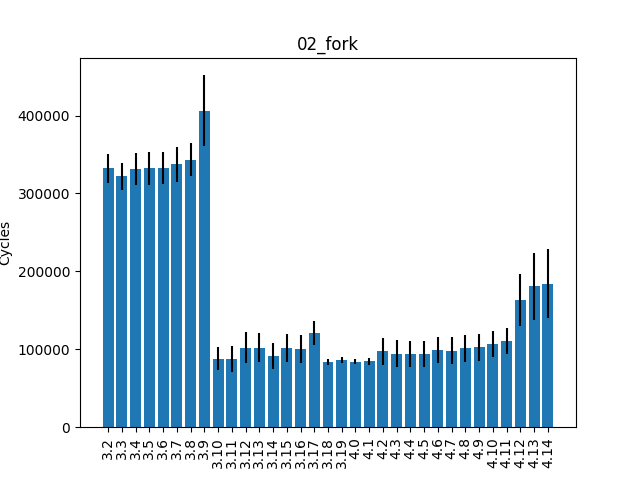
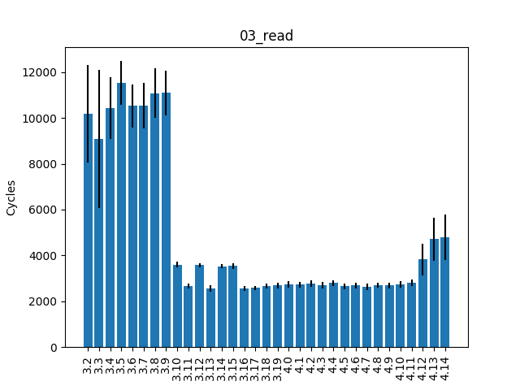
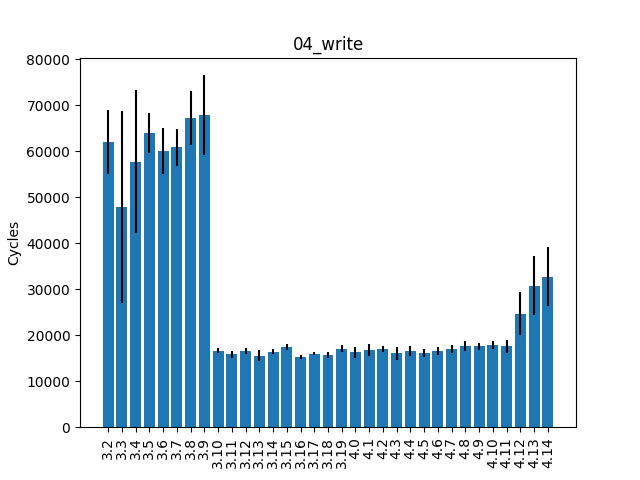
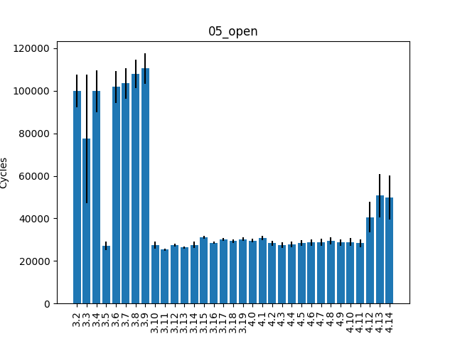
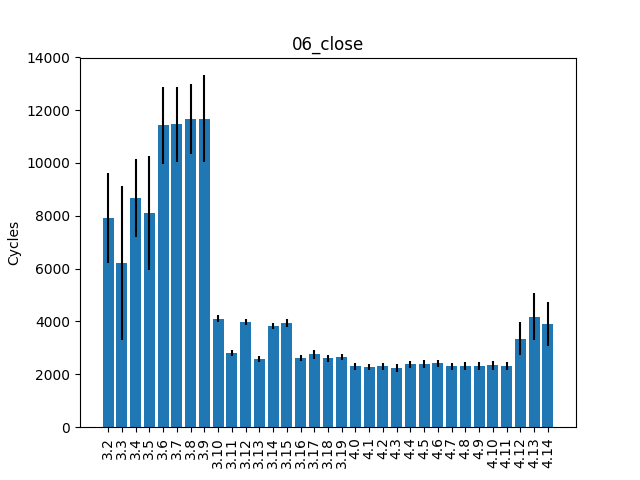
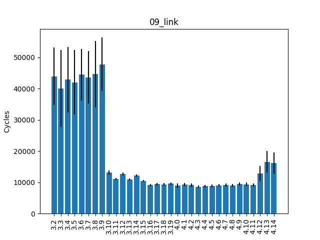
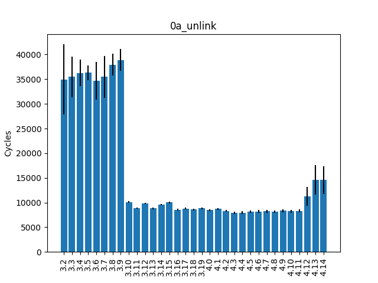
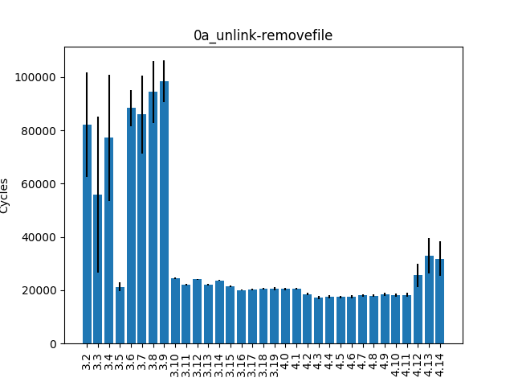
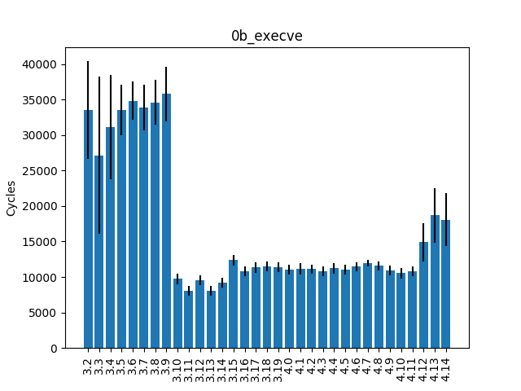
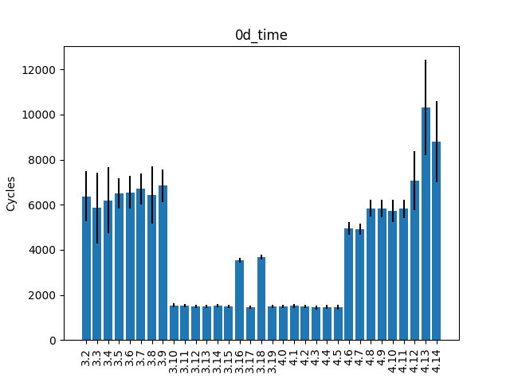
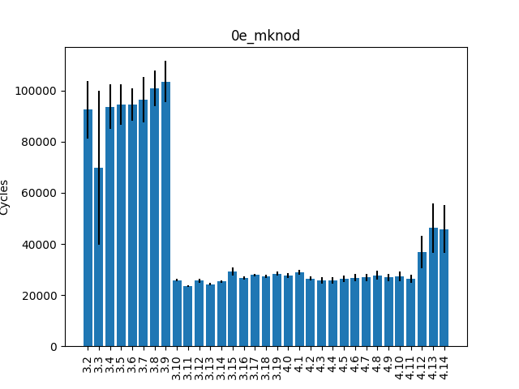
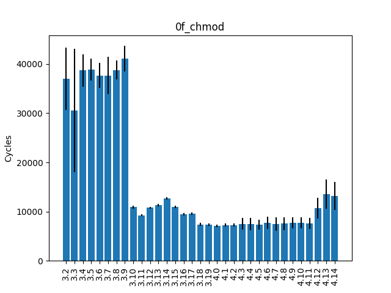
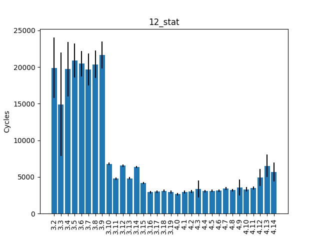
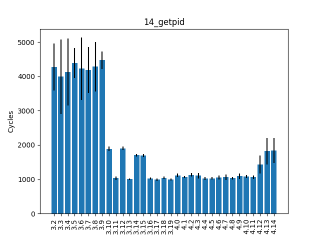
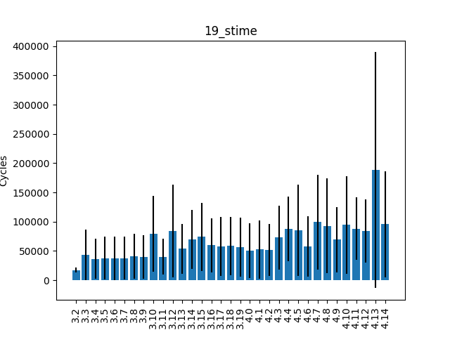
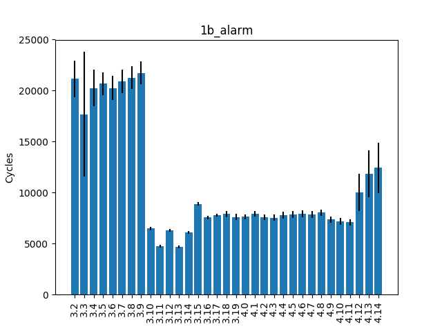
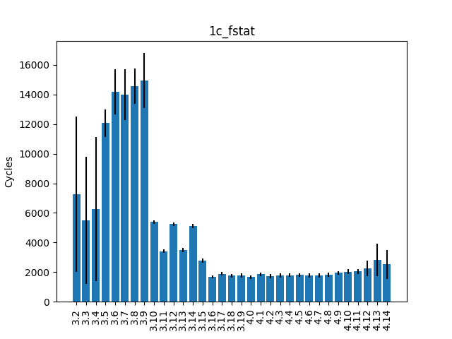
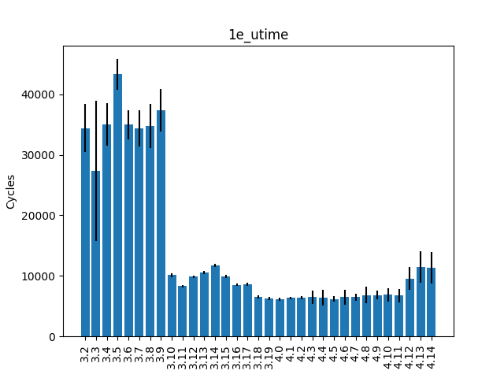
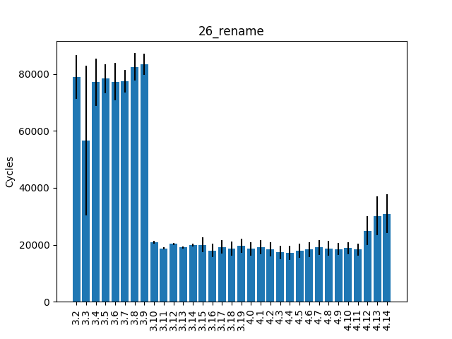
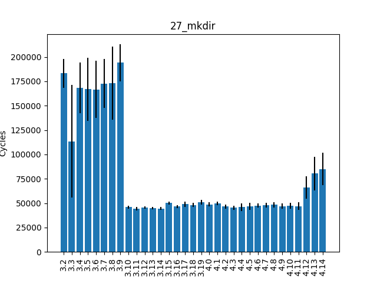
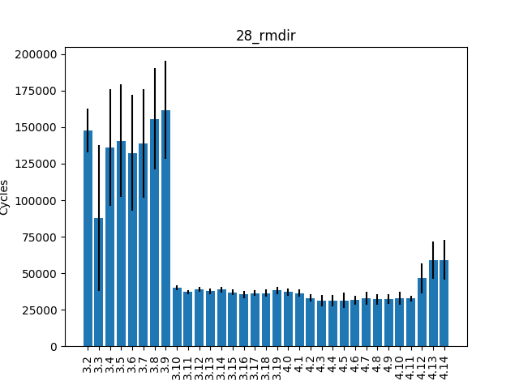
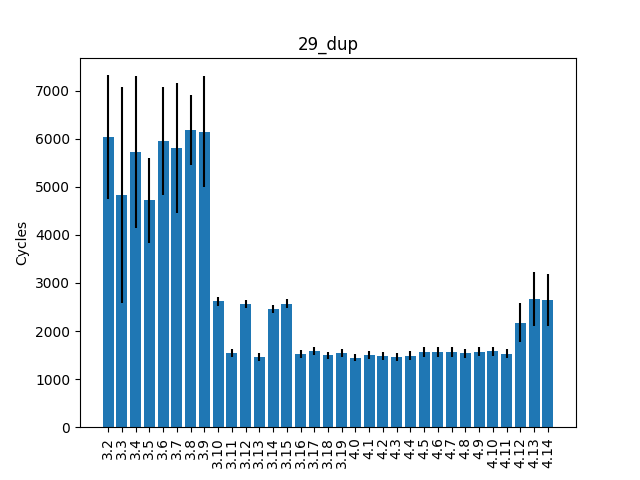
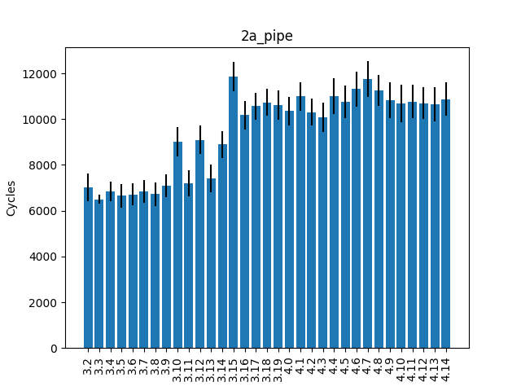
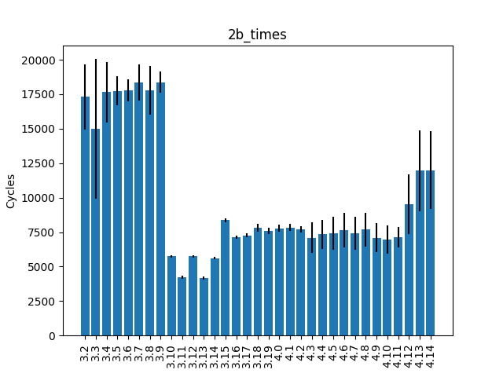
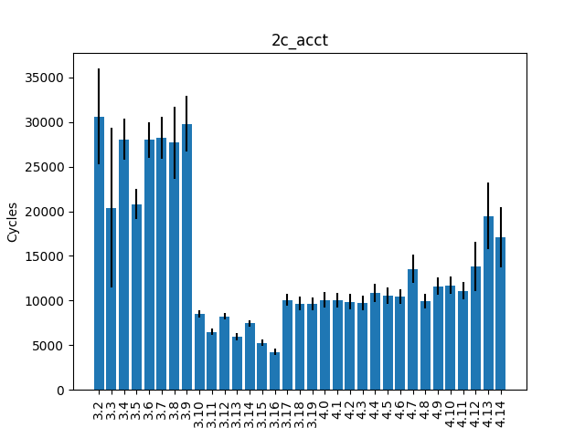
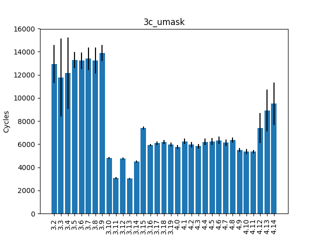
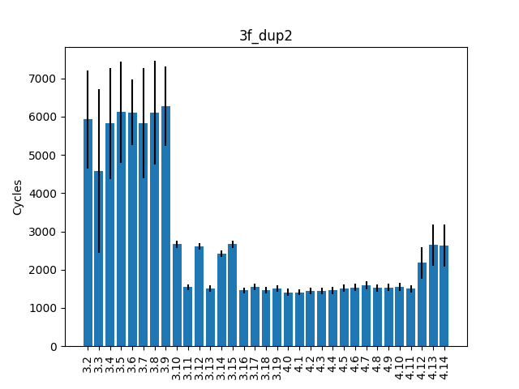
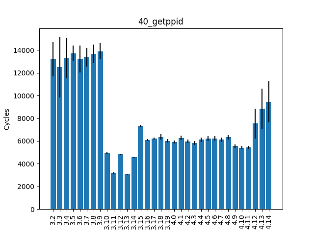
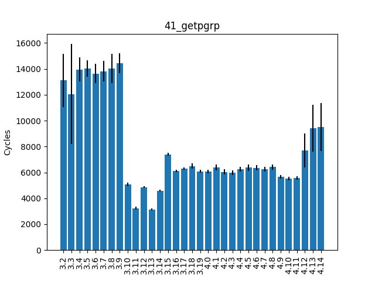
